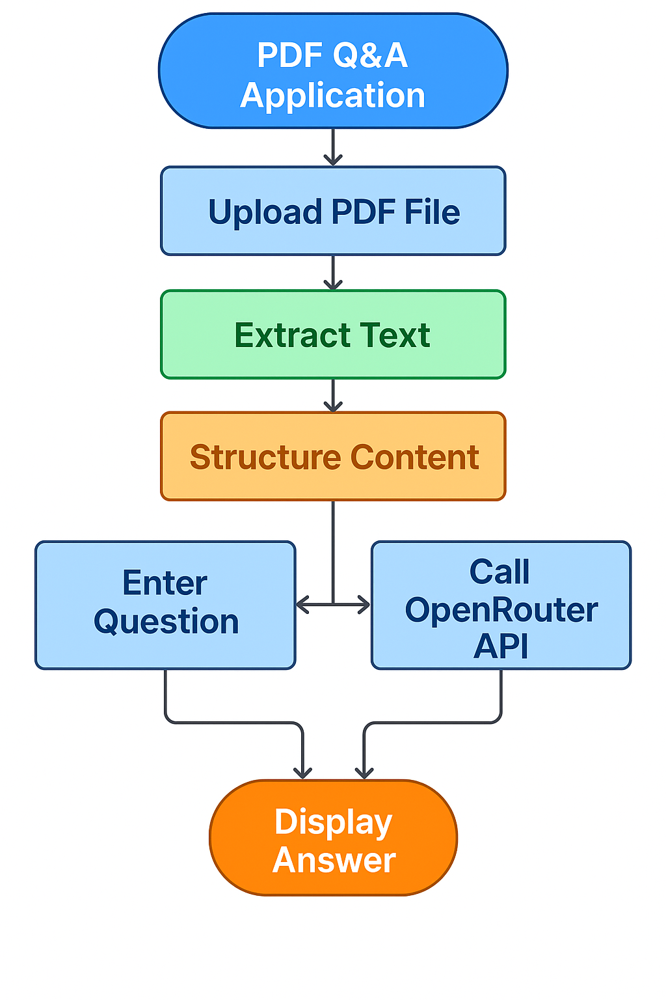

# OpenPDF-Direct

A professional, production-ready PDF Question-and-Answer system powered by **direct LLM prompting (no RAG)**.  
OpenPDF-Direct transforms PDF documents into an interactive conversational experience using **Streamlit**, **PyMuPDF**, and **OpenRouter**.



---

## 🚀 Features
- **Direct LLM prompting — no retrieval/RAG**  
- **Fast, reliable PDF text extraction** with PyMuPDF  
- **Automatic section detection** for cleaner context  
- **Chunking & summarization** for large documents  
- **Follow‑up question generation**  
- **Fully dockerized** & production ready  
- **CI pipeline**, Dependabot support, and pre‑commit hooks  
- **Clear flowcharts (Mermaid + Figma)** documenting architecture  

---

## 📁 Project Structure
```
app.py                     # Streamlit launcher
src/pdfqa/utils.py         # Core logic
README.md                  # Project documentation
FLOWCHART_DETAILED.md      # Technical explanation of workflow
flowchart_colored.mmd      # Mermaid source
architecture.mmd           # Mermaid architecture diagram
docs/
   flowchart_colored.png   # Rendered flowchart
.github/
   workflows/ci.yml        # CI pipeline
   dependabot.yml          # Automated dependency updates
tests/                     # pytest test suite
Dockerfile
requirements.txt
.env.example
```

---

## 🚀 Getting Started

### 1. Install dependencies
```bash
pip install -r requirements.txt
```

### 2. Configure environment variables  
Create a `.env` file:

```
OPENROUTER_API_KEY=your_key_here
OPENROUTER_API_URL=https://openrouter.ai/api/v1/chat/completions
OPENROUTER_MODEL=openai/gpt-3.5-turbo-0613
```

### 3. Run the app
```bash
streamlit run app.py
```

---

## 🐳 Docker
```bash
docker build -t openpdf-direct .
docker run -e OPENROUTER_API_KEY=your_key -p 8501:8501 openpdf-direct
```

---

## 🧪 Testing
```bash
pytest -q
```

---

## 🤝 Contributing
Please read `CONTRIBUTING.md` for guidelines.  
All contributions (bug fixes, improvements, docs, diagrams) are welcome.

---

## 📜 License
This project is licensed under the terms of the MIT License.  
See the `LICENSE` file for full details.

---

## 🌟 Acknowledgment
- Author: **Floyd Steev Santhmayer**
- AI integrations powered by **OpenRouter**
